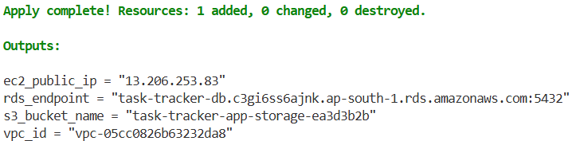
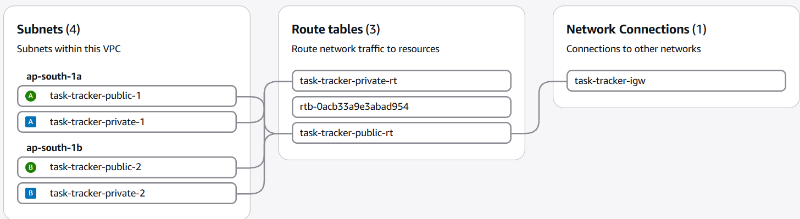
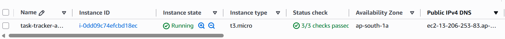
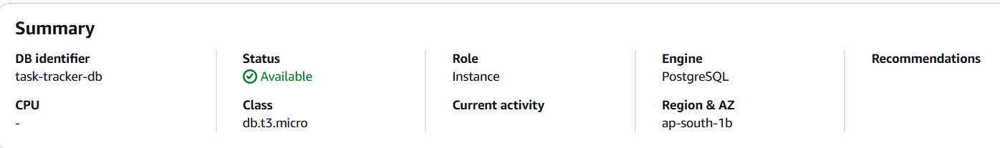
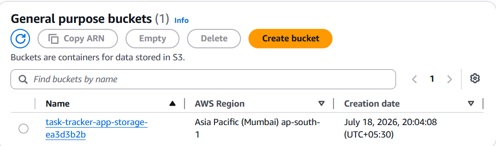

# AWS Infrastructure as Code — Terraform

Provisions a small but realistic AWS environment entirely from code: a VPC with public and private subnets across two availability zones, an EC2 instance, an S3 bucket, an IAM role (no static credentials on the instance), and an RDS PostgreSQL database — fully reproducible with `terraform apply` and fully removable with `terraform destroy`. Every resource, from the network layout down to the database engine version, is defined in version-controlled code rather than clicked together in the AWS Console.

---

## Table of Contents

- [Overview](#overview)
- [Architecture](#architecture)
- [Tech Stack](#tech-stack)
- [Project Structure](#project-structure)
- [Network Design](#network-design)
  - [Public vs Private Subnets](#public-vs-private-subnets)
  - [Security Groups](#security-groups)
  - [Why No NAT Gateway](#why-no-nat-gateway)
- [Module Breakdown](#module-breakdown)
- [Prerequisites](#prerequisites)
- [Setup](#setup)
- [Running It](#running-it)
- [Outputs](#outputs)
- [Results](#results)
- [Teardown](#teardown)
- [Cost Notes](#cost-notes)
- [Relationship to Other Projects](#relationship-to-other-projects)

---

## Overview

Project 1 in this series (a CI/CD pipeline) required manually clicking through the AWS Console to create an EC2 instance and its security group by hand. That works for one server, once — it doesn't scale, isn't repeatable, and leaves no record of exactly what was created or why.

This project replaces that manual process with **Infrastructure as Code**: the entire environment — network, compute, storage, and database — is described in Terraform (`.hcl`) files. Running `terraform apply` builds it; running `terraform destroy` tears it down completely, with no risk of forgetting a resource and leaving it running (and billing).

This is a **DevOps/infrastructure portfolio project** — the goal is to demonstrate real Infrastructure-as-Code practice (modular design, least-privilege networking, reproducible provisioning), not to run a production workload.

---

## Architecture

```
                              +---------------------------------------------+
                              |                   VPC                       |
                              |               10.0.0.0/16                   |
                              |                                             |
   Internet                  |   +-------------------------------------+   |
      |                      |   |         Public Subnets (x2 AZ)      |   |
      |   Internet Gateway   |   |        10.0.1.0/24, 10.0.2.0/24      |   |
      +----------------------+-->|                                      |   |
                              |   |   +------------------------------+  |   |
                              |   |   |   EC2 (t3.micro)             |  |   |
                              |   |   |   web-sg: 22 (admin IP),     |  |   |
                              |   |   |           8000 (app)         |  |   |
                              |   |   +--------------+---------------+  |   |
                              |   +------------------+------------------+   |
                              |                      | (web-sg allowed)     |
                              |   +------------------v------------------+   |
                              |   |        Private Subnets (x2 AZ)      |   |
                              |   |       10.0.11.0/24, 10.0.12.0/24     |   |
                              |   |                                      |   |
                              |   |   +------------------------------+  |   |
                              |   |   |  RDS PostgreSQL (db.t3.micro)|  |   |
                              |   |   |  db-sg: 5432 from web-sg only|  |   |
                              |   |   |  publicly_accessible = false |  |   |
                              |   |   +------------------------------+  |   |
                              |   +--------------------------------------+   |
                              +---------------------------------------------+

        IAM Role --> attached to EC2 --> grants S3 read/write (no static keys on the box)
        S3 Bucket --> app storage, all public access blocked
```

**Provisioning flow:** `terraform init` (download AWS provider) -> `terraform plan` (preview, free) -> `terraform apply` (create) -> `terraform destroy` (remove everything in one command).

---

## Tech Stack

| Component            | Technology                          |
|-----------------------|--------------------------------------|
| **IaC tool**           | Terraform >= 1.5.0, AWS provider ~> 5.0 |
| **Networking**         | AWS VPC, subnets, route tables, Internet Gateway |
| **Compute**            | AWS EC2 (t3.micro, Ubuntu 22.04, free-tier eligible) |
| **Database**           | AWS RDS PostgreSQL 16.10 (db.t3.micro, free-tier eligible) |
| **Storage**            | AWS S3 (public access blocked) |
| **Identity**           | AWS IAM role + instance profile (no static credentials on EC2) |
| **Language**           | HCL (HashiCorp Configuration Language) |

---

## Project Structure

```
project2-terraform-aws/
|
├── main.tf                    # wires all four modules together
├── variables.tf                 # root-level input variables
├── outputs.tf                   # VPC ID, EC2 public IP, S3 bucket name, RDS endpoint
├── versions.tf                  # Terraform + provider version requirements
├── terraform.tfvars.example     # template - copy to terraform.tfvars and fill in
├── Makefile                     # shortcuts: make init / plan / apply / destroy
|
└── modules/
    ├── network/                 # VPC, public + private subnets, route tables, security groups
    │   ├── main.tf
    │   ├── variables.tf
    │   └── outputs.tf
    |
    ├── storage/                 # S3 bucket, public access block, versioning
    │   ├── main.tf
    │   └── outputs.tf
    |
    ├── compute/                 # EC2 instance, IAM role/policy/instance profile
    │   ├── main.tf
    │   ├── variables.tf
    │   └── outputs.tf
    |
    └── database/                 # RDS PostgreSQL + DB subnet group
        ├── main.tf
        ├── variables.tf
        └── outputs.tf
```

---

## Network Design

### Public vs Private Subnets

The VPC (`10.0.0.0/16`) is split into two tiers, each spread across two availability zones for redundancy:

- **Public subnets** (`10.0.1.0/24`, `10.0.2.0/24`) route `0.0.0.0/0` traffic through an Internet Gateway. The EC2 instance lives here, since it needs to be reachable from the internet.
- **Private subnets** (`10.0.11.0/24`, `10.0.12.0/24`) have no route to the internet at all - only local VPC traffic. RDS lives here, and never needs to be reached from outside the VPC.

### Security Groups

Two security groups enforce least-privilege access:

- **`web-sg`** (attached to EC2): allows SSH (port 22) only from the admin's own IP, and the app port (8000) from anywhere.
- **`db-sg`** (attached to RDS): allows PostgreSQL (port 5432) **only from `web-sg`**, referenced by security group ID rather than by IP range. Even if someone discovered the RDS endpoint, it is unreachable from anywhere except the EC2 instance itself.

### Why No NAT Gateway

A NAT Gateway costs roughly $32/month just for being provisioned, regardless of usage. This project's private subnet only needs to host RDS, which doesn't require outbound internet access - only reachability from the EC2 instance inside the same VPC. Skipping the NAT Gateway keeps this project genuinely free-tier while still following the standard public/private subnet pattern used in production networks.

---

## Module Breakdown

| Module | Creates | Key design choice |
|---|---|---|
| `network` | VPC, IGW, 4 subnets, 2 route tables, 2 security groups | Private subnet has no NAT - cost-conscious by design |
| `storage` | S3 bucket, public access block, versioning config | All public access explicitly blocked at the bucket level |
| `compute` | EC2 instance, IAM role, IAM policy, instance profile | EC2 gets S3 access via an IAM role, never a static access key |
| `database` | RDS PostgreSQL instance, DB subnet group | `publicly_accessible = false`, `skip_final_snapshot = true` for clean demo teardown |

---

## Prerequisites

- Terraform >= 1.5.0 (https://developer.hashicorp.com/terraform/install)
- AWS CLI installed and configured (`aws configure`) with a valid access key
- An existing EC2 key pair in your target AWS region

---

## Setup

```bash
git clone https://github.com/<your-username>/terraform-aws-infrastructure.git
cd terraform-aws-infrastructure

cp terraform.tfvars.example terraform.tfvars
# edit terraform.tfvars: set key_pair_name and my_ip_cidr (curl ifconfig.me for your IP)
```

Never commit a real database password - set it as an environment variable instead:
```bash
export TF_VAR_db_password="your-strong-password-here"     # Linux/Mac
# $env:TF_VAR_db_password = "your-strong-password-here"    # Windows PowerShell
```

---

## Running It

```bash
terraform init
terraform fmt -recursive
terraform validate
terraform plan
terraform apply
```

Or using the Makefile shortcuts:
```bash
make init
make plan
make apply
```

RDS provisioning is the slowest step - expect `apply` to take 5-10 minutes end to end.

---

## Outputs

After `apply`, Terraform prints:

| Output | Description |
|---|---|
| `vpc_id` | The created VPC's ID |
| `ec2_public_ip` | SSH here, or hit `http://<ip>:8000/health` once the app is deployed |
| `s3_bucket_name` | The app storage bucket |
| `rds_endpoint` | Use as the DB host when connecting the app to Postgres |

---

## Results

This configuration was applied against a real AWS account and verified working end to end:

- `terraform plan` correctly showed 24 resources to add, 0 to change, 0 to destroy
- `terraform apply` completed successfully, provisioning the full VPC, EC2 instance, S3 bucket, and RDS database
- The RDS instance came up in **Available** status, running PostgreSQL, confirmed **not publicly accessible**
- The EC2 instance was reachable via SSH and served the app's health endpoint over its public IP
- `terraform destroy` cleanly removed all resources afterward, confirmed against the AWS Console and a $0.00 billing check

### Screenshots

| Screenshot | Description |
|---|---|
|  | `terraform apply` output showing all outputs (VPC ID, EC2 public IP, RDS endpoint, S3 bucket) |
|  | VPC in the AWS Console showing public and private subnets across 2 AZs |
|  | EC2 instance in the **running** state with its assigned public IP |
|  | RDS PostgreSQL instance in **Available** status, confirmed not publicly accessible |
|  | S3 bucket created by the `storage` module, public access blocked |

*(Place the corresponding PNG files in a `screenshots/` folder at the repo root for these to render.)*

---

## Teardown

```bash
terraform destroy
```
or
```bash
make destroy
```

One command removes the VPC, subnets, EC2 instance, S3 bucket, and RDS database together - the key advantage over Project 1's manual, resource-by-resource teardown in the AWS Console.

---

## Cost Notes

- EC2 `t3.micro` and RDS `db.t3.micro` are both free-tier eligible.
- No NAT Gateway, no Elastic IP, no Multi-AZ RDS - all deliberately avoided to keep this at $0 for a short-lived demo.
- Always run `terraform destroy` after taking screenshots - nothing here is meant to run 24/7.

---

## Relationship to Other Projects

This is Project 2 in a 3-part DevOps portfolio series:

1. **CI/CD Pipeline** - FastAPI app, Docker, GitHub Actions, deployed to manually-provisioned EC2
2. **Infrastructure as Code (this project)** - the same style of environment, provisioned entirely from Terraform instead of the Console
3. **Kubernetes Deployment** - the same app, run under container orchestration with monitoring

Together they cover CI/CD, cloud networking, Infrastructure as Code, and container orchestration - the core skill areas expected of a DevOps/Cloud intern.
